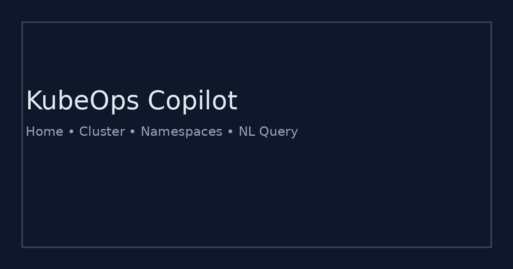
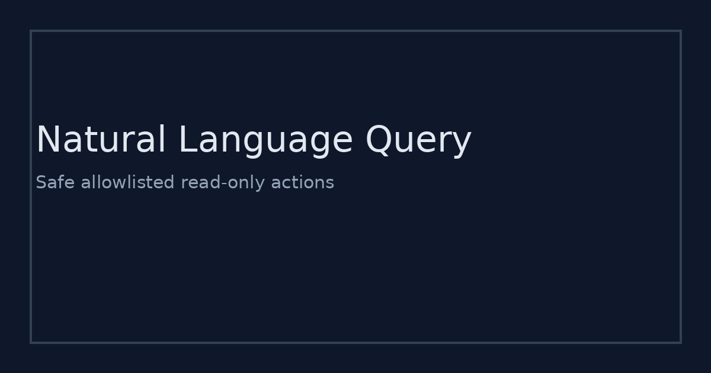

# KubeOps Copilot (Kubernetes Operations Assistant)


A **read-only**, safety-first Kubernetes operations assistant you can run locally or in Docker. It is designed to **reduce time-to-triage** during incidents by making common cluster reads fast, consistent, and auditable.

**Portfolio-safe:** this is an original MVP codebase (not internship code) that demonstrates the same problem space with a deployable, recruiter-friendly setup.

---

## What problem does it solve?

### Pain points
- On-call engineers lose time remembering commands and where to look first.
- Debugging requires context switching: terminal, dashboards, runbooks, Slack.
- Granting cluster access is risky without guardrails and an audit trail.

### What KubeOps Copilot provides
- Fast cluster visibility (namespaces, pods, events, logs).
- Natural language query (NLQ) mapped to **allowlisted, read-only** actions.
- Safety gates + input validation + **audit logging** for every NLQ action.

---

## Screenshots

> These are placeholders in `assets/` so your GitHub page looks complete. Replace with real screenshots later.




---

## Features

- Cluster overview (mock mode or real cluster mode)
- Namespaces and pods explorer
- Events viewer per namespace
- Pod logs viewer (read-only)
- NLQ: prompt -> allowlisted read action -> structured response
- Audit log (SQLite) recording who/when/what was queried

---

## Quickstart (recommended)

### Option A: Docker (fastest)
```bash
docker compose up --build
# open http://localhost:8000
```

### Option B: Local
```bash
python -m venv .venv
source .venv/bin/activate
pip install -r requirements.txt
uvicorn app.main:app --reload --port 8000
```

---

## Demo mode vs Real cluster mode

### Demo mode (default, no cluster needed)
Uses `sample/mock_cluster.json`, so everything works immediately.

```bash
export K8S_MODE=mock
uvicorn app.main:app --reload
```

### Real cluster mode (read-only)
Uses your kubeconfig. This MVP is read-only by design.

```bash
export K8S_MODE=real
export KUBECONFIG=~/.kube/config
uvicorn app.main:app --reload
```

> Tip: If you are running inside Docker, mount your kubeconfig and set `KUBECONFIG` accordingly.

---

## Safety model (why this is “safe by default”)

- **Allowlist-only execution:** NLQ maps to a finite set of read actions.
- **No write operations:** no deletes, no apply, no scale, no exec.
- **Input validation:** namespace/pod names are validated and sanitized.
- **Audit trail:** every NLQ request is recorded with timestamp and action.

---

## Repo structure

```
k8s-ops-assistant/
  app/
    main.py               # FastAPI routes
    core/
      security.py         # allowlist + validators
      nlq.py              # NLQ router
      k8s_client.py       # mock/real adapters
      audit.py            # sqlite audit log
    templates/            # UI pages
    static/               # styles + small JS
  sample/                 # mock data
  assets/                 # README screenshots (placeholders)
  docker-compose.yml
  Dockerfile
```

---

## Deploying

This is a local-first MVP. For a simple deployment:
- Build a container image
- Run behind a reverse proxy (Caddy/Nginx)
- Keep it **read-only** and behind auth if used with a real cluster

---

## Suggested commit history (so the repo looks professional)

If you want clean commits on GitHub, use something like:
1. `chore: bootstrap fastapi app + ui`
2. `feat: add mock cluster adapter`
3. `feat: add namespaces/pods/logs pages`
4. `feat: add nlq allowlist + validation`
5. `feat: add sqlite audit log`
6. `chore: dockerize + docs + ci`

---

## License
MIT (see `LICENSE`).
